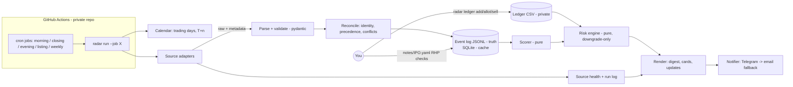

# Design Document — IPO Radar

## Overview

IPO Radar is a small, batch-style Python application. GitHub Actions starts it at fixed IST times on trading days. Each run follows the same pipeline:

1. Pull allowlisted public sources.
2. Normalise and reconcile the data into per-IPO views.
3. Score each IPO with the scorecard and apply risk limits.
4. Render and send alerts.

There is no server, no UI and no broker login. All requirements referenced below are in [requirements.md](requirements.md).

**Recommended stack**
- **Python 3.12** with `uv`.
- Libraries: `httpx`, `selectolax`, `pydantic` v2, `sqlite3` (stdlib), `jinja2`, `typer`.
- Tests: `pytest`, `hypothesis` and `respx`; linting with `ruff`.

**Why not Spring Boot:** this is a 1–2 minute cron batch job. Python gives the fastest cold start on CI, light HTML parsing and good property-based testing. A Java 21 + jsoup + picocli version would follow the same design. Spring Boot adds nothing here.

**Where it runs:** a **private** repository (`ipo-radar`) holds the code, config, notes and data (Req 11.5). This public repo keeps the spec, steering and example config. Kiro hooks are event-based, not clock-based, so the schedule lives in GitHub Actions. Kiro Web Automations (scheduled agent runs that open PRs) suit a weekly research report, not 07:40 alerts.

## Architecture



### Repository layout (private repo)

```
ipo-radar/
  pyproject.toml
  src/ipo_radar/
    cli.py  config.py  models.py  calendar.py  reconcile.py  store.py
    scoring.py  risk.py  render.py  health.py  ledger.py  charges.py
    sources/  base.py sebi_filings.py nse_issues.py nse_bhavcopy.py
              ipowatch.py investorgain.py manual.py
    notify/   telegram.py email.py
    templates/  digest.md.j2 card.md.j2 closing.md.j2
  config/   risk-limits.yaml sources.yaml charges.yaml holidays-2026.yaml scoring.yaml
  notes/    <ipo-key>.yaml          # your RHP checks (Req 2.4)
  data/     events/YYYY-MM.jsonl  ledger/applications.csv ledger/sales.csv  cards/
  tests/    fixtures/ unit/ property/ e2e/
  .github/workflows/radar.yml
```

## Components and interfaces

```python
class SourceAdapter(Protocol):
    name: str                      # key in config/sources.yaml (allowlist)
    def fetch(self, ctx: FetchContext) -> FetchResult: ...     # http via PoliteClient
    def parse(self, raw: FetchResult) -> list[Observation]: ...

class PoliteClient:                # the only HTTP client adapters may use (Req 9)
    def get(self, source: str, url: str) -> Response: ...
    # checks allowlist + robots.txt (cached daily), per-domain rate limit and daily cap,
    # descriptive User-Agent, run cache; on 401/403/429/CAPTCHA -> SourceBlocked (no retry until tomorrow)

def reconcile(obs: list[Observation], aliases: AliasTable) -> dict[IpoKey, IpoView]: ...
def score(view: IpoView, cfg: ScoringConfig) -> ScoreResult: ...                      # pure
def apply_limits(r: ScoreResult, ledger: LedgerState, lim: RiskLimits) -> ScoreResult  # pure, never upgrades
def render(kind: AlertKind, views, results, ctx) -> list[Message]: ...               # <= 4000 chars each
class Notifier(Protocol):
    def send(self, msg: Message) -> SendResult: ...
```

`Observation` is a tagged union: `IssueFact`, `Subscription`, `Gmp`, `Filing`, `PriceEod`, `Anchor`. Every variant carries `source`, `url`, `observed_at` (UTC) and `raw_hash`.

### Source adapters (tested on 2 Oct 2026 from a cloud IP)

| Adapter | Endpoint | Provides | Max cadence | Test result | Status |
|---|---|---|---|---|---|
| `sebi_filings` | SEBI → Filings → Public Issues listing pages (DRHP, RHP, prospectus) | New filings, RHP links, upcoming pipeline | 1×/day | 200, lists recent RHPs (Runwal, SRIT, 23 Sep) | **Use.** robots.txt blocks only `/js`, `/css` |
| `sebi_rss` | `https://www.sebi.gov.in/sebirss.xml` | Orders, circulars, press releases (**no** DRHP/RHP items) | 1×/day | 200, 30 items | Optional regulatory news |
| `nse_issues` | `https://www.nseindia.com/api/ipo-current-issue` | Open issues: dates, band, size, bids, subscription | 4×/day | 200 with data; NSE homepage 403; `all-upcoming-issues` came back empty | **Use with caution.** Undocumented interface; terms of use not located. Showed 0.44x for Vishal Nirmiti vs 0.57–0.60x elsewhere (likely NSE-only bids) |
| `nse_bhavcopy` | `https://nsearchives.nseindia.com/content/cm/BhavCopy_NSE_CM_0_0_0_<YYYYMMDD>_F_0000.csv.zip` | Official end-of-day OHLC for listing performance | 1×/day after 18:30 | 200 (208 KB zip for 1 Oct) | **Use** |
| `ipowatch` | Subscription, GMP, listing and allotment pages; `/feed/` RSS | Consolidated category subscription, GMP, dates, registrar, SME list | 2×/day | Pages 200; RSS live | **Use with caution.** Unofficial; robots.txt allows (blocks `/wp-json`, `/wp-admin`); no terms page found |
| `investorgain` | IPO and GMP pages | GMP history, subscription | 2×/day | 200 | **Use with caution.** robots.txt allows; content signal `ai-train=no` (we don't train) |
| `bse` | `api.bseindia.com` | Issues | — | **403 (Akamai)** from cloud | Avoid from CI |
| `upstox_read` (optional) | Upstox *Get IPOs / IPO details* | Lot size, bands, categories, mandate end time | 1×/day | Not tested (needs account and daily token; expires 03:30) | Read-only if you ever open Upstox. **Never** the apply endpoint |
| `manual` | `notes/*.yaml`, `data/manual/*.csv` | RHP inputs, anchors, corrections | On demand | — | Always-available fallback |

**Registrar allotment pages** (MUFG Intime, KFin, Bigshare, etc.) use CAPTCHAs. They are not automated; alerts link to them instead (Req 9.7).

### Reconciliation

- **Identity:**
  - Key = normalised name (lowercase; strip "limited/ltd/india/the" and punctuation) + board + open date.
  - An `alias` table catches mismatches such as "Nityas Gems" vs "Nityas Gems and Jewellery Limited".
  - If a match is uncertain, emit a "check identity" note rather than merging.
- **Field precedence** (`sources.yaml`):
  - Issue facts: SEBI/NSE > aggregator > manual-unverified. Manual entries you have *verified* override all.
  - Subscription: freshest consolidated source, with NSE as cross-check.
  - Prices: bhavcopy only.
- **Conflicts:** the same metric, within 3 hours, differing by more than 20% → keep both and flag "sources disagree" (Req 3.3).

## Data model

**Event log** — `data/events/*.jsonl`. Append-only and the source of truth; committed by CI to the private repo. Each line is one serialised `Observation`.

**SQLite cache** — rebuilt from the event log at the start of each run:

| Table | Key columns |
|---|---|
| `ipo` | key, name, board, symbol, open/close/allot/listing dates, price_low/high, lot, min_amount, issue_size, fresh, ofs, icdr_route, qib_quota_pct, registrar, rhp_url |
| `alias` | alias → ipo_key |
| `fact` | ipo_key, field, value, source, observed_at, user_verified |
| `subscription` | ipo_key, category, times, shares_bid, shares_offered, source, observed_at |
| `gmp` | ipo_key, gmp_inr, gmp_pct, source, observed_at |
| `filing` | company, doc_type, filed_on, url |
| `price_eod` | symbol, date, open, high, low, close |
| `score` | ipo_key, computed_at, total, factors_json, knockouts_json, label, reasons_json, inputs_hash |
| `alert_log` | dedupe_key (type+ipo+date) unique, channel, sent_at, status |
| `source_health` | source, last_ok_at, last_error_kind, consecutive_failures, blocked_until |
| `run_log` | run_id, job, started_at, ended_at, summary_json |

**Ledger** — CSV in the private repo, edited only through `radar ledger …` (Req 7):
- `applications.csv`: id, ipo_key, applied_on, category, lots, bid_price, amount_blocked, status (pending / allotted / not_allotted / withdrawn), allotted_shares, paper (bool), decision_label, notes.
- `sales.csv`: application_id, sold_on, qty, price.

Charges and tax rates are computed from `charges.yaml`. No PAN, UPI ID, account or application numbers are stored (Req 11.3).

## Scoring

The scoring logic is the scorecard from [`ipo/04-evaluation-scorecard.md`](../../../ipo/04-evaluation-scorecard.md). Weights and thresholds live in `scoring.yaml` and `risk-limits.yaml`.

```python
def score(v: IpoView, cfg) -> ScoreResult:
    failed = [k.id for k in KNOCKOUTS if k.fails(v, cfg)]          # K1..K7; unknown K-inputs -> flag, not fail
    pts = {
      "A": growth(v) , "B": balance(v), "C": valuation(v, cfg.peer_bands),
      "D": structure(v), "E": clean_checks(v), "F": anchors(v),
      "G": demand(v, qib_valid=v.qib_quota_pct >= 30),             # Req 4.5
      "H": gmp_point(v),                                          # <=1, needs >=10% on 2 sources, not falling (Req 4.6)
    }                                                             # any unknown input contributes 0 (Req 2.5)
    total = sum(pts.values())
    if failed:                                   label = "SKIP"
    elif total >= cfg.min_score_apply and pts["G"] >= cfg.min_demand_points: label = "APPLY"
    elif total >= cfg.min_score_watch:           label = "WATCH"
    else:                                        label = "SKIP"
    return ScoreResult(total, pts, failed, label, reasons=top3(pts, v))
```

**Where each input comes from:**
- G and H are automatic.
- F comes from anchor notices (automatic where parsable, else manual).
- A–E need RHP numbers: from `notes/<ipo>.yaml`, which you fill in 5–10 minutes, or from aggregator figures flagged unverified.
- **Unverified values score 0 by default.**

`apply_limits` then downgrades only (Req 4.8, 5):
- over the per-IPO cap → SKIP;
- blocked or monthly limits reached → WATCH;
- paper-only mode → WATCH (paper-only).

Every result is stored with an `inputs_hash`, so score changes are auditable (Req 4.7).

## Scheduler

| Job | IST | `cron` (UTC) | Runs when |
|---|---|---|---|
| morning | 07:37 Mon–Fri | `37 2 * * 1-5` | Trading day: full fetch, Digest |
| closing | 14:12 Mon–Fri | `42 8 * * 1-5` | An IPO closes today: snapshot, rescore, closing update |
| listing | 08:47 Mon–Fri | `17 3 * * 1-5` | An IPO lists today: reminder with your written exit plan |
| evening | 18:37 Mon–Fri | `7 13 * * 1-5` | Final subscription, T+1 allotment reminders, bhavcopy, health |
| weekly | Sun 18:07 | `37 12 * * 0` | Weekly preview, calibration and paper-vs-real report |

- **Timing:** off-the-hour minutes avoid GitHub's top-of-hour queue delays. Late starts are reported (Req 12.5).
- **Workflow settings:** `concurrency: radar` prevents overlapping runs; `workflow_dispatch` allows manual runs.
- **Permissions:** `contents: write` only, used to commit the event log; actions pinned by SHA.
- **Cost:** ≈ 5 jobs × ~1.5 min × 22 days ≈ 170 min/month, well inside GitHub Free's private-repo quota.
- **Holidays:** `holidays-2026.yaml` is copied from the NSE circular (Oct–Dec 2026: 20 Oct, 10 Nov, 24 Nov, 25 Dec; Muhurat trading Sun 8 Nov).

## Notifications

- **Telegram** via the Bot API `sendMessage` to one private chat. Uses HTML parse mode and stays ≤4,000 characters; longer content becomes a link to the card in the private repo. Telegram's guidance is about 1 message per second per chat; we send ≤ 10 a day.
- **Email fallback** via Gmail SMTP with an **app password** (requires 2-Step Verification), triggered after 3 failed Telegram attempts with backoff (Req 6.2).
- **WhatsApp** only through the official Business Platform: utility templates cost about ₹0.115 each in India, and service messages are billable after 1,000/month from 1 Oct 2026. Disabled by default; unofficial WhatsApp libraries are banned (terms-of-service risk).
- **Deduplication:** a send happens only if `alert_log.dedupe_key` is new (Req 6.5).

## Error handling

| Failure | Detection | Behaviour |
|---|---|---|
| Network / timeout / 5xx | httpx exception, status code | 2 retries with jitter; then mark source failed for this run |
| Blocked (401/403/429/CAPTCHA) | Status code or CAPTCHA marker | `SourceBlocked`; `blocked_until` = tomorrow; **no bypass** (Req 9.5) |
| Parser drift | Expected selectors or keys missing | `ParserDrift` with a sample saved to `data/quarantine/`; alert "parser drift: <source>" (Req 10.2) |
| Invalid record | pydantic validation | Quarantine; keep last good value marked stale (Req 10.1) |
| All subscription sources stale > 6 h while open | Freshness check | Show "unavailable"; **no APPLY** (Req 10.4) |
| Two consecutive failures of a source | `source_health` | Health alert (Req 10.3) |
| Telegram down | send error ×3 | Email fallback; both down → run log + GitHub job failure notification |
| Bad config | Schema validation at start | Config-error alert, no labels (Req 5.1) |

## Security and compliance

- No order or IPO-apply code anywhere (Req 11.1). A guardrail test greps `src/` and `config/` for forbidden patterns, such as `/ipos/orders`, `place_order`, `modify_order` and broker order SDK imports, and fails CI. The Kiro hook in `.kiro/hooks/ipo-radar.json` does the same review on save.
- Secrets live only in GitHub Actions secrets: `TELEGRAM_BOT_TOKEN`, `TELEGRAM_CHAT_ID`, `SMTP_USER`, `SMTP_APP_PASSWORD`. They are masked in logs and never written to the event log.
- `PoliteClient` is the single HTTP path, enforcing allowlist, robots.txt, rate limits, descriptive User-Agent and no evasion (Req 9).
- Ledger privacy is enforced by `ledger_repo_private` plus the CI visibility check (Req 7.8).

## Correctness properties (property-based tests with Hypothesis)

1. **Bounds:** for any input, 0 ≤ total ≤ 20, each factor ≤ its max, and GMP points ≤ 1.
2. **Knock-out dominance:** any failed knock-out ⇒ label SKIP.
3. **Unknown never helps:** replacing a known input with unknown never increases the score.
4. **Downgrade-only:** `rank(apply_limits(r)) ≤ rank(r)` for all ledgers and limits (APPLY > WATCH > SKIP).
5. **Calendar:**
   - `t_plus(T, n)` is always a trading day;
   - it is strictly increasing in n;
   - it never lands on a configured holiday.
6. **Idempotency:** ingesting the same responses twice yields the same cache state and no extra alerts.
7. **P&L arithmetic:**
   - net = sale − cost − charges;
   - charges ≥ 0;
   - estimated tax is 0 when the gain is ≤ 0.
8. **Message size:** every rendered message is ≤ 4,000 characters.
9. **No secret leakage:** random secret strings placed in the environment never appear in rendered messages or logs.

## Testing strategy

- **Unit tests** per adapter, using fixture responses captured once into `tests/fixtures/`, including a drifted variant of each.
- **Contract tests** checking the schema of every `Observation`.
- **Property tests** for the nine properties above.
- **End-to-end** `radar run --job morning --dry-run --fixtures` producing a golden digest file.
- **Guardrail tests** for forbidden endpoints and secrets.
- CI runs on every push. The PostTaskExec Kiro hook runs `pytest` after each spec task once it is enabled.

## Open questions for you

1. Python OK, or do you want the Java 21 variant?
2. Private repo name: `ipo-radar`?
3. Telegram as the primary channel? You create the bot with @BotFather in about 2 minutes; I never see the token.
4. A fallback email address with a Gmail app password, or skip email?
5. Confirm the `risk-limits.yaml` values before the first non-paper alert.
